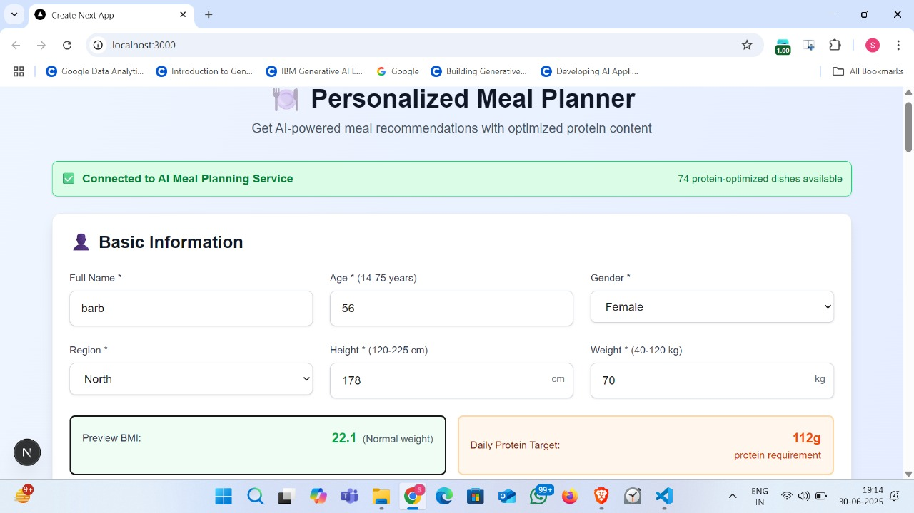
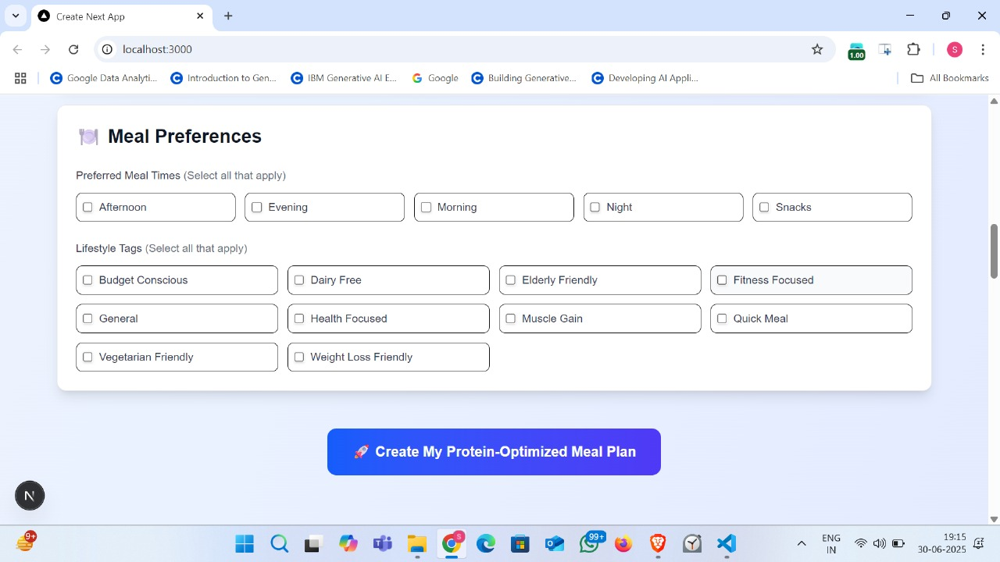
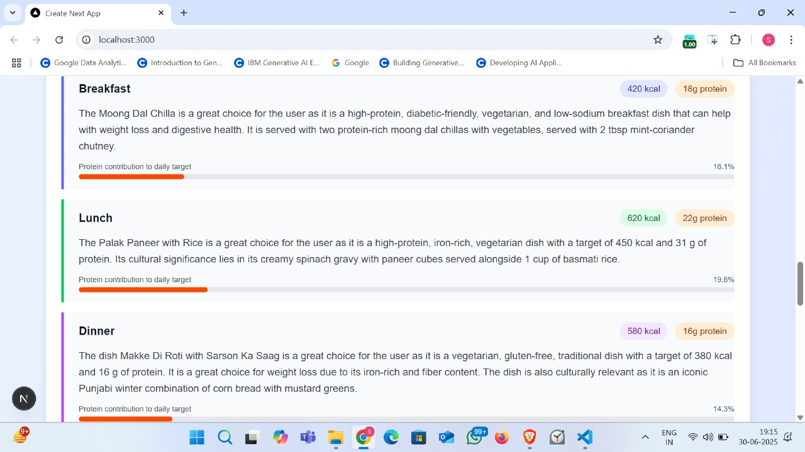
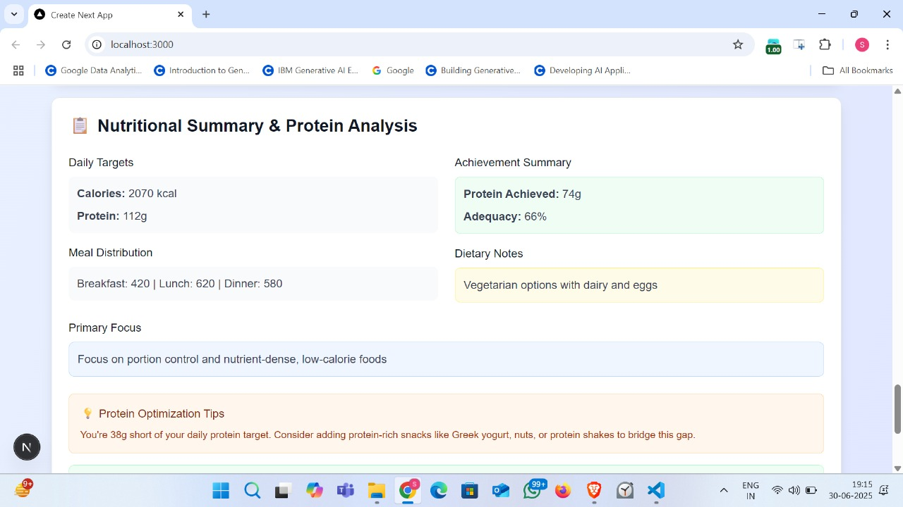

# 🍽️ FitFeast - AI-Powered Personalized Meal Planner  

FitFeast is an **AI-driven meal planner** that generates personalized meal plans tailored to your **body type, lifestyle, health goals, and dietary preferences**.  
It optimizes protein intake using a **Retrieval-Augmented Generation (RAG) pipeline** and provides **real-time AI recommendations**.  

---

## 🚀 Features
- 🔥 Personalized daily protein targets (based on weight, BMI, and goals)  
- 🍲 AI-generated Indian meal plans with **74 curated dishes**  
- ✅ Options for **weight loss, muscle gain, or balanced nutrition**  
- 🌱 Handles **dietary preferences & allergies** (vegetarian, gluten-free, dairy-free, etc.)  
- 🕒 Customizable **meal times & lifestyle tags** (quick meals, budget-friendly, fitness-focused)  
- 📊 Daily **protein summary & optimization tips**  

---

## 📸 Screenshots  

### Basic Info & Protein Requirement
  

### Meal Preferences  
  

### Personalized Meal Plan  
  

### Nutritional Summary  
  

---

## ⚙️ How It Works
1. **User Input**: Age, gender, height, weight, region, goals, allergies, preferences.  
2. **AI Pipeline**:  
   - Retrieves relevant dishes from curated database (74+ Indian meals).  
   - Uses **RAG + LaMini-Flan-T5 (783M)** to generate personalized plans.  
3. **Output**:  
   - Meal plan (breakfast, lunch, dinner, snacks) with calories & protein.  
   - Protein adequacy score + optimization tips.  

---

## 🛠️ Tech Stack
- **Frontend**: Next.js, Tailwind CSS  
- **Backend**: Node.js, Express, MongoDB  
- **AI/ML**: RAG pipeline with LaMini-Flan-T5 (783M)  
- **Other**: BMI & BMR calculations, dietary logic  
